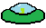
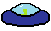
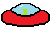

<h1> 🎮 Space Defender </h1>
<h2> :beginner: Sobre o projeto </h2>
<h4> Space Defender é um projeto com o intuito de produzir um jogo simples para praticar programação em Python. </h4>

<h2> :page_with_curl: Sobre o jogo </h2>
<h4> O Planeta Terra está prestes a ser invadido por uma grande frota de naves alienígenas, os extra-terrestres possuem o objetivo de destruir a humanidade e dominar completamente o planeta, e você, como o último piloto de elite na Terra, foi convocado para pilotar uma das naves espaciais mais poderosas já construídas, a "Space Defender". </h4>
<h4> Seu principal objetivo é enfrentar as hordas de naves alienígenas e manter a segurança do planeta (por enquanto). </h4>

<h2> 📌 Status do projeto </h2>
<h4> ⏳ Em desenvolvimento </h4>
<h4> 📅 Estimativa de conclusão: Final de 2023 </h4>

<h2> 🖥️ Tecnologias utilizadas </h2>
    

<h2> 🕹️ Controles </h2>
<table>
  <th> Tecla </th>
  <th> Função </th>
  <tr>
    <td> Movimentação da nave </td>
    <td> W, A, S, D ou ⬆️ ⬅️ ⬇️ ➡️ </td>
  </tr>
  <tr>
    <td align = center> Atirar </td>
    <td align = center> Espaço </td>
  </tr>
  <tr>
    <td align= center>Jogar novamente </td>
    <td align = center>R </td>
  </tr>
</table>

<h2> 🎮 Como rodar o jogo</h2>
<h3>1. É preciso que você possua o <a href="https://git-scm.com/downloads"> Git </a> e o <a href="https://www.python.org/downloads/"> Python </a> instalado. </h3>
<h3> 2. Pesquise por terminal na barra de tarefas  do seu dispositivo e abra o terminal. </h3>
<h3> 3. Clone o repositório inserindo este comando: </h3>

    git clone https://github.com/velipefieira/SpaceDefender.git

<h3> 4. Após clonar o repositório, entre na pasta do projeto. </h3>

    cd SpaceDefender

<h3> 5. Se preferir, crie um ambiente virtual para rodar o jogo com os seguintes comandos (opcional): </h3>

    python -m venv venv

<h3> 5.1 Caso tenha criado o ambiente virtual, ligue-o com o seguinte comando: </h3>

    .\venv\Scripts\activate

<h6> 5.2 Caso esteja utilizando um sistema operacional linux, utilize o seguinte comando: </h3>

    source venv\bin\activate

<h3> 6. Instale os requisitos para rodar o jogo utilizando o seguinte comando: </h3>

    python -r requirements.txt
    
<h3> 7. Rode o jogo e se divirta! </h3>

    python main.py
    
<h2> Esta é a aparência do jogo atualmente </h2>

<h2> Versões criadas até o momento </h2>
<table>
  <th>
    Nome versão
  </th>
  <th>
    Tag
  </th>
  <tr>
    <td>
      Beta 1.0
    </td>
    <td align = center>
      <a href="https://github.com/velipefieira/SpaceDefender/tree/Beta1.0"> 🎟️ </a>
    </td>
  </tr>
  <tr>
    <td> Beta 1.1 </td>
    <td align = center>
      <a href="https://github.com/velipefieira/SpaceDefender/tree/Beta1.1"> 🎟️ </a>
    </td>
  </tr>
</table>

<h2> </h2>

<h2> Elementos do jogo </h2>
<table>
  <th> Nome </th>
  <th> Descrição </th>
  <tr>
    <td> Player </td>
    <td> Esta é a nave que você controla, você possui inicialmente 3 vidas, podendo ganhar ou perder vidas ao decorrer do jogo </td>
    <td> 
  </tr>
  <tr>
    <td> Míssil </td>
    <td> Este é o projetil que você pode lançar para destruir inimigos, podendo ser lançado apenas um por vez </td>
    <td> 
  </tr>
    </tr>
    <tr>
    <td> Vida </td>
    <td> Este é o elemento que define a vida do jogador, o jogo termina após ela chegar em 0.</td>
    <td> 
  </tr>
  <tr>
    <td> Alien Verde </td>
    <td> Este é o inimigo inicial, disponível logo após iniciar o jogo </td>
    <td> 
  </tr>
    <tr>
    <td> Alien Azul </td>
    <td> Este é o inimigo "nível 2", disponível logo após alcançar a marca de 20 pontos </td>
    <td> 
  </tr>
  </tr>
    <tr>
    <td> Alien Vermelho </td>
    <td> Este é o inimigo "nível 3", disponível logo após alcançar a marca de 40 pontos </td>
    <td> 
  </tr>
    </tr>
    <tr>
    <td> Alien Cinza </td>
    <td> Este é o inimigo "nível 4", disponível logo após alcançar a marca de 60 pontos </td>
    <td> 
  </tr>
    </tr>
    <tr>
    <td> (Un)Lucky Item </td>
    <td> Este é um item misterioso, gerado ocasionalmente na gameplay, o qual pode oferecer efeitos positivos, como ganho de vida, velocidade e pontos, ou efeitos negativos, como perda de vida ou velocidade. </td>
    <td> 
  </tr>

</table>
<table>
  <th> Nome </th>
  <th> Descrição </th>
  <th> Status </th>
  <tr>
    <td> Movimentação </td>
    <td> Controlar a nave por W, A, S, D ou setinhas </td>
    <td> :white_check_mark: Concluído </td>
  </tr>
  <tr>
    <td> Disparo de projéteis </td>
    <td> Disparar projéteis que destruam as naves alienígenas </td>
    <td> :white_check_mark: Concluído </td>
  </tr>
  <tr>
    <td> Inimigos </td>
    <td> Naves alienígenas que voam em direção ao player </td>
    <td> :white_check_mark: Concluído <td>
  </tr>
  <tr>
    <td> Sistema de vida e pontuação </td>
    <td> Perder vida ao ser atingido e ganhar pontos ao destruir uma nave alienígena </td>
    <td> :white_check_mark: Concluído </td>
  </tr>
    <tr> 
    <td> Sistema de jogar novamente </td>
    <td> Permitir o usuário reiniciar o jogo clicando "R" </td>
    <td> :white_check_mark: Concluído </td>
  </tr>
  <tr>
    <td> Interface gráfica </td>
    <td> Exibição da hud do jogo </td>
    <td> :white_check_mark: Concluído </td>
  </tr>
  <tr>
    <td> Sistema de fases e progresso </td>
    <td> Permitir que sejam gerados mais inimigos ao passar do tempo </td>
    <td> :white_check_mark: Concluído </td>
  </tr>
  <tr>
    <td> Geração de obstáculos </td>
    <td> Criar obstáculos que spawnam durante a gameplay, ex: Meteoros. </td>
    <td> :white_check_mark: Concluído </td>
  </tr>
  <tr>
    <td> Sistema de power-ups </td>
    <td> Permitir que o usuário colete power-ups de poder ou vida ao decorrero do jogo. </td>
    <td> :white_check_mark: Concluído </td>
 </tr>
   <tr>
    <td> Som e Áudio </td>
    <td> Música e efeitos sonoros que permitem uma maior imersão na gameplay </td>
    <td> ⏳ Em desenvolvimento  </td>
  </tr>
 <tr>
   <td> Multiplayer local </td>
   <td> Tornar disponíveis a gameplay para 1 ou 2 players </td>
   <td> ✖️ Não iniciado </td>
 </tr>
</table>

<h2> Feedbacks e seguestões favor entrar em contato: </h2>

<a href=""mailto:felipevieiragabriel@gmail.com""> </img></a>
